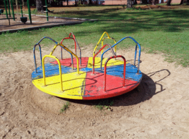

# Roundabout

**Roundabout is in pre-alpha - use at your risk**

## Introduction
Roundabout is a utility application designed to ease integration of
legacy bulletin board systems (BBS) with modern Internet services.
Roundabout is intended to sit between a Dos emulator (e.g. DosBox)
and provide a single server port for clients. 

For example, Dosbox can handle translating Modem/COM port connections
to TCP/IP, but you typically need to assign a single TCP port per
BBS node. Your customers will then need to keep a list of available
ports and try each one until they find a port that is not in use.

Roundabout allows them to connect to a single server socket - then
Roundabout handles forwarding the Telnet traffic to the correct 
Dosbox port. 

This kind of implementation also opens the door to other kinds of 
future uses. For example, Roundabout could in the future provide a 
SSH port for securing the communications between the BBS nodes and
the client. 

Roundabout is not limited to use by the server. It is also possible
for the user/client to run Roundabout locally, but the current 
utility of this setup is suspect. 

## Compiling

### Prerequisites
1. GO compiler 1.19
2. GNU Make

### Compiling Instructions
Simply run `make all` from the root project directory. The Roundabout
binaries will be placed in the `dist` directory.

## Usage

Roundabout requires a `config.yaml` file in order to run. You can generate
a sample config file with "sane" defaults by running `roundabout config init`.

Then you need to set the appropriate configuration parameters (not all parameters)
are currently implemented. 

To run Roundabout, execute: `./roundabout serve path-to-config.yaml`

